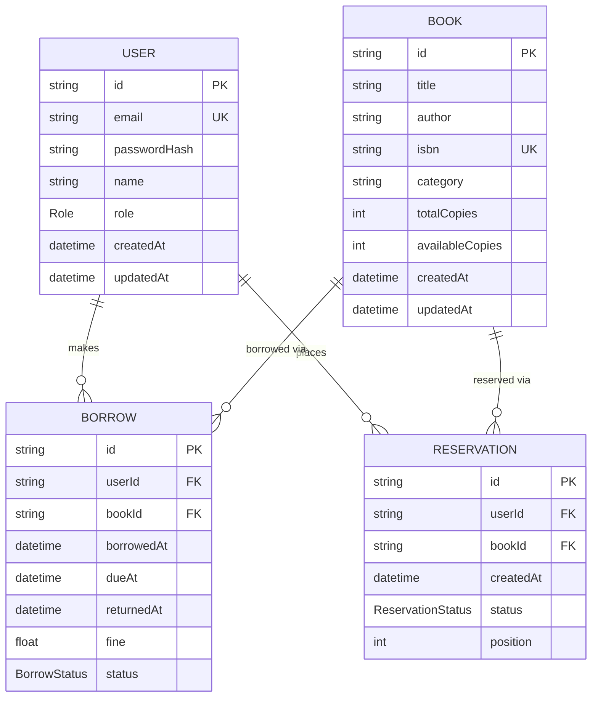

# LibraryHub — Database ERD

```mermaid
erDiagram
    USER ||--o{ BORROW : makes
    USER ||--o{ RESERVATION : places
    BOOK ||--o{ BORROW : "borrowed via"
    BOOK ||--o{ RESERVATION : "reserved via"

    USER {
        string id PK
        string email UK
        string passwordHash
        string name
        Role role
        datetime createdAt
        datetime updatedAt
    }

    BOOK {
        string id PK
        string title
        string author
        string isbn UK
        string category
        int totalCopies
        int availableCopies
        datetime createdAt
        datetime updatedAt
    }

    BORROW {
        string id PK
        string userId FK
        string bookId FK
        datetime borrowedAt
        datetime dueAt
        datetime returnedAt
        float fine
        BorrowStatus status
    }

    RESERVATION {
        string id PK
        string userId FK
        string bookId FK
        datetime createdAt
        ReservationStatus status
        int position
    }
```